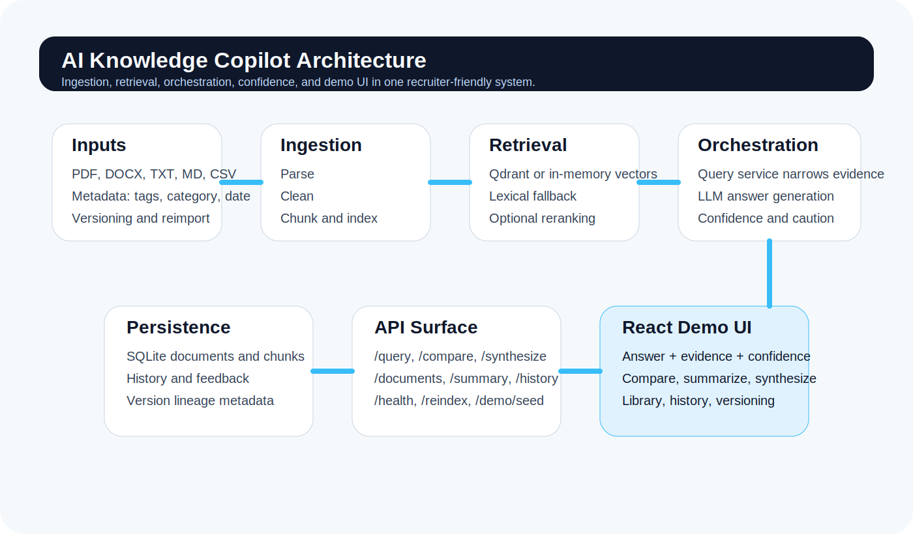
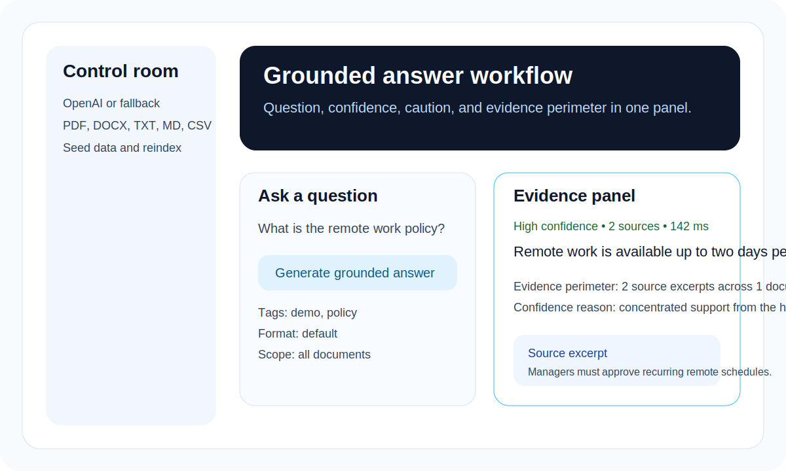
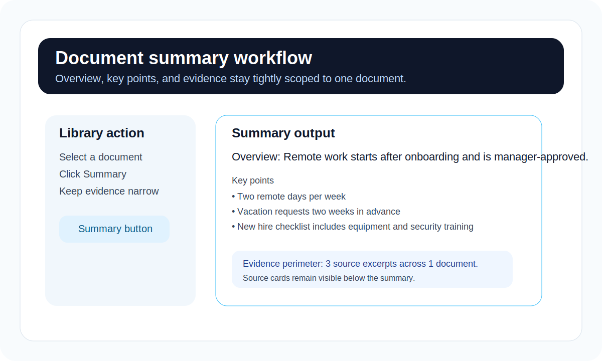
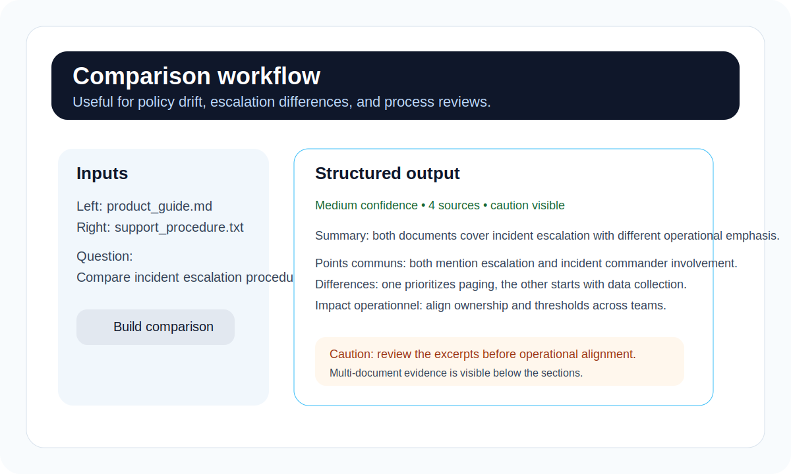
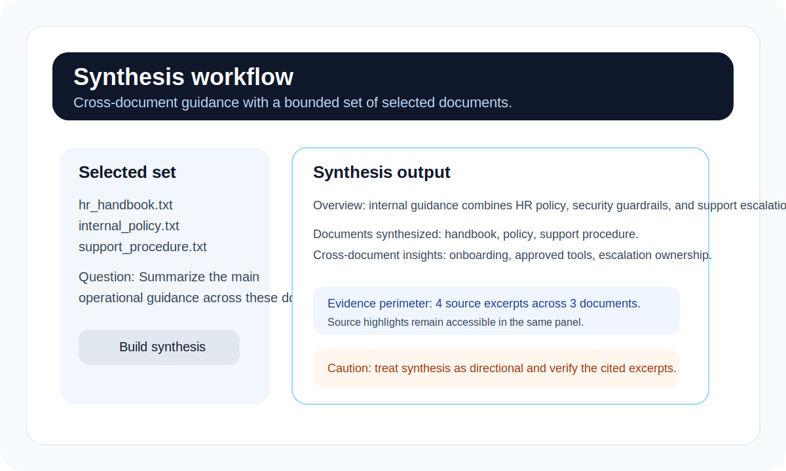
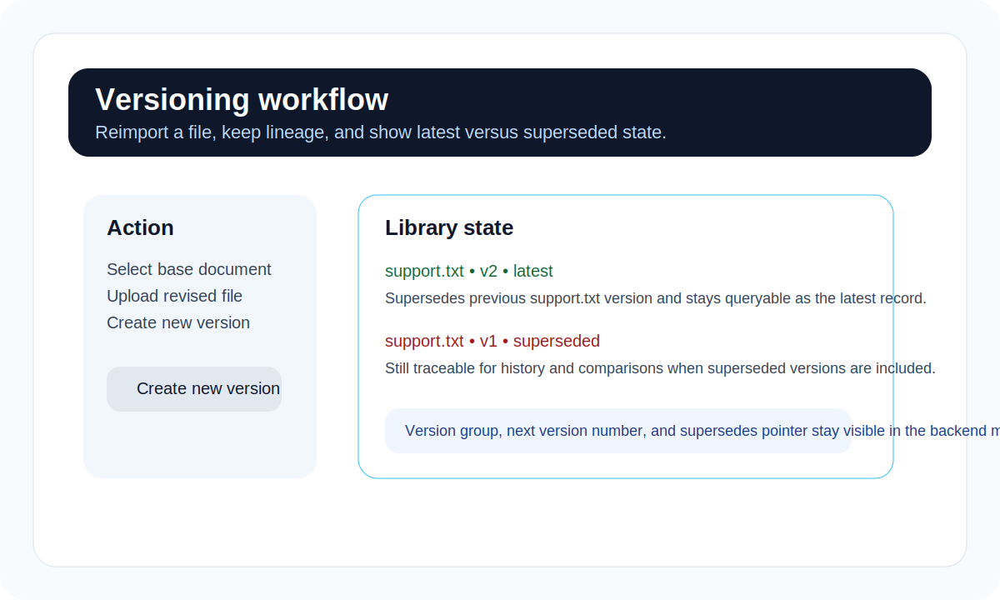

# AI Knowledge Copilot

AI Knowledge Copilot is a grounded internal knowledge assistant demo built to prove three things at once:

- practical RAG architecture
- product thinking beyond raw chat
- recruiter-friendly demo quality

The app ingests internal files, retrieves the most relevant evidence, answers with citations, and exposes confidence, caution, and supporting source excerpts directly in the UI.



## Why This Project Exists

Internal knowledge is usually fragmented across handbooks, policies, support notes, and operational procedures. Traditional search often returns noise, while generic chat tools can answer without enough grounded evidence.

This project demonstrates a more credible pattern:

- retrieval before generation
- source narrowing before final answer
- confidence signals instead of false certainty
- workflows for summary, comparison, synthesis, and versioning

## Demo Highlights

- grounded question answering with source excerpts
- explicit evidence perimeter and confidence explanation
- structured single-document summaries
- document comparison for policy or procedure drift
- cross-document synthesis
- metadata filters for tag, category, date, and version state
- query history plus helpful / not helpful feedback
- React frontend tuned for portfolio and interview demos

## Visual Walkthrough

These vector walkthrough cards can be replaced later by real screenshots or GIFs, but they already give a recruiter a fast sense of the product shape.

| Grounded answer | Summary |
| --- | --- |
|  |  |

| Compare | Synthesize |
| --- | --- |
|  |  |

| Versioning |
| --- |
|  |

## Supported Inputs

The ingestion pipeline currently supports:

- `PDF`
- `DOCX`
- `TXT`
- `MD`
- `CSV`

Current limits:

- no OCR for scanned PDFs
- no native `XLSX`, `PPTX`, email, or connector ingestion yet
- no auth, workspace boundaries, or permissions in this iteration

## Product Workflows

### 1. Ask a grounded question

The backend retrieves candidate chunks, narrows context, generates an answer, then only displays the most relevant supporting sources.

### 2. Summarize one document

The app produces a structured recap with overview, key points, and supporting evidence.

### 3. Compare two documents

Useful for showing differences between procedures or policy variants, with operational implications surfaced as a structured result.

### 4. Synthesize multiple documents

The user selects multiple documents and receives a grounded cross-document synthesis instead of generic free-form chat.

### 5. Reimport a new version

The document lineage is preserved through version group, version number, and superseded pointers.

## Architecture At A Glance

- Backend: FastAPI, Pydantic, SQLite
- Retrieval: Qdrant when available, in-memory fallback otherwise
- Embeddings and generation: OpenAI mode or local fallback mode
- Frontends: React + Vite as the primary demo, Streamlit as a dev/demo fallback
- Testing: pytest

More detail lives in [docs/architecture.md](docs/architecture.md).

## Runtime Modes

### Recommended demo mode

`OpenAI + Qdrant`

This is the strongest recruiter or client-facing mode because it gives the best answer quality and the most realistic retrieval behavior.

### Local fallback mode

`local-fallback + in-memory retrieval`

This is useful for development, testing, and evaluation when external services are unavailable. It is intentionally kept visible in the UI so reviewers can tell which mode is running.

## Quick Start

### 1. Local setup

```bash
python -m venv .venv
source .venv/bin/activate
pip install -r requirements.txt
cp .env.example .env
```

### 2. Start the backend

```bash
PYTHONPATH=. .venv/bin/uvicorn backend.main:app --reload --host 127.0.0.1 --port 8010
```

### 3. Start the React frontend

```bash
cd frontend-react
npm install
npm run dev -- --host 127.0.0.1 --port 5173
```

Expected URLs:

- React demo: `http://localhost:5173`
- FastAPI docs: `http://localhost:8010/docs`
- Healthcheck: `http://localhost:8010/health`

### 4. Seed the demo dataset

```bash
curl -X POST http://127.0.0.1:8010/demo/seed
```

### 5. Optional Streamlit frontend

```bash
API_BASE_URL=http://localhost:8010 .venv/bin/streamlit run frontend/app.py --server.port 8502
```

## 5-Minute Demo Flow

1. Open the React frontend and confirm the runtime mode in the sidebar.
2. Seed the dataset if needed.
3. Load the `Grounded question` scenario and ask: `What is the remote work policy?`
4. Point out the answer, confidence box, caution message, and source excerpts.
5. Load the comparison scenario and show structured differences between `product_guide.md` and `support_procedure.txt`.
6. Load the synthesis scenario to show cross-document reasoning.
7. Reimport a document as a new version to show version lineage and latest-vs-superseded handling.
8. Open recent history and capture feedback to show traceability.

The full script lives in [docs/demo-guide.md](docs/demo-guide.md).

## Quality And Evaluation

The repository now includes a lightweight evaluation harness for demo scenarios. It checks:

- that a question is answered
- that grounded sources are returned
- that the expected documents appear in evidence
- that key answer terms show up in the response

Run it against a live API:

```bash
PYTHONPATH=. .venv/bin/python scripts/evaluate_demo.py --api-base-url http://127.0.0.1:8010
```

See [docs/evaluation.md](docs/evaluation.md) for the reference scenarios and acceptance criteria.

## Design Decisions

- Hybrid retrieval: semantic retrieval is useful, but lexical overlap remains important for exact internal wording and policy language.
- Citations over unsupported prose: the UI is opinionated about showing evidence, not hiding it.
- Confidence heuristics: simple heuristics are better than silent certainty for a portfolio demo.
- Backend/frontend separation: the domain logic sits behind the API so the product can evolve independently of the UI surface.

## API Surface

### Health and admin

- `GET /health`
- `POST /reindex`
- `POST /demo/seed`

### Documents

- `GET /documents`
- `POST /documents/upload`
- `POST /documents/{id}/reimport`
- `DELETE /documents/{id}`
- `POST /documents/{id}/summary`

### Querying

- `POST /query`
- `POST /query/compare`
- `POST /query/synthesize`

### History

- `GET /history`
- `POST /history/{id}/feedback`

## What I Would Ship Next In Production

- OCR for scanned PDFs
- background indexing jobs and better ingestion status handling
- auth, workspaces, and permissions
- connector ingestion for Notion, Drive, SharePoint, or Slack
- richer evaluation and analytics dashboards

## Known Limits

- no OCR yet
- no external connectors
- no deployment config or infra in-repo
- no authorization layer

For roadmap context, see [docs/roadmap.md](docs/roadmap.md).
